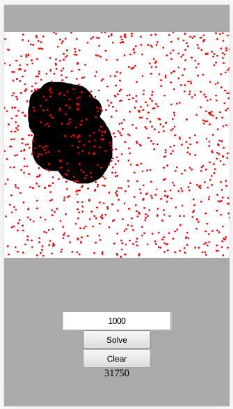

# Finding Areas Using the Monte Carlo Method

Using the [Monte Carlo Method](http://mathonweb.com/entrtain/monte/t_monte.htm) to find the area of an drawn image.

Live version [here](https://victorribeiro.com/monteCarlo)

## About

Draw an image, run the monte carlo method to calculate it's area. Increase or decrese the number of samples used in the simulation. I have written a similar code that runs the simulation several times and get the mean of them all. I like this one better.

## How to use it

Canvas - Draw the image you want to calculate the area from.

Input - Enter the number of samples to be used in the simulation, in the input box.

Solve - Click to solve the aproximate area of the drawn image. You can click solve multiple times to get different results.

Clear - Clear the canvas.
